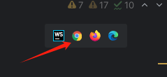
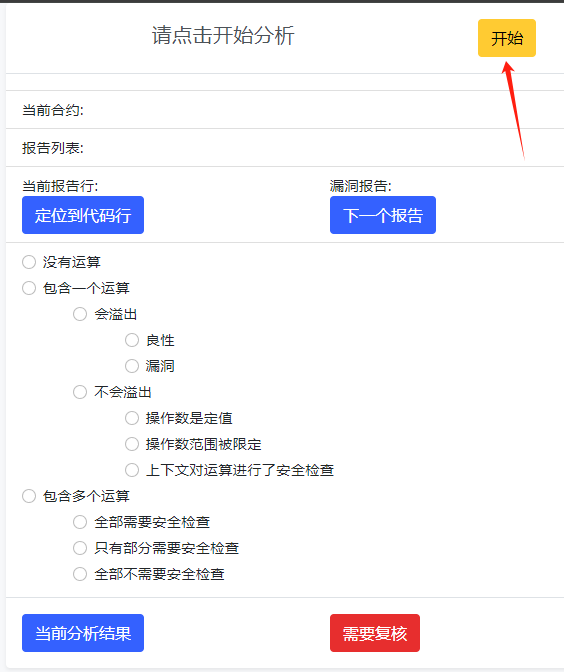
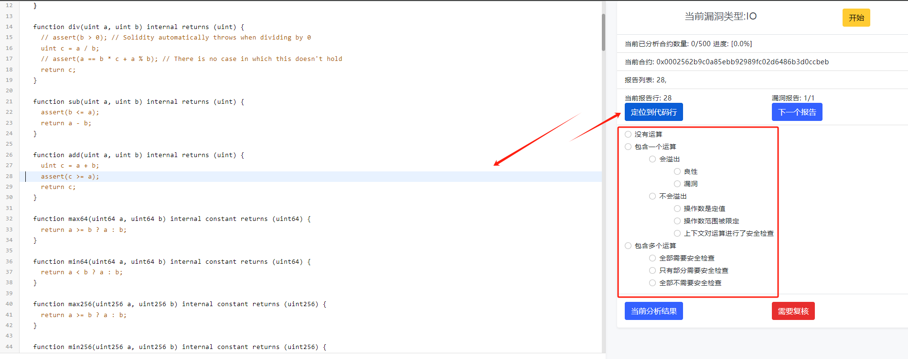
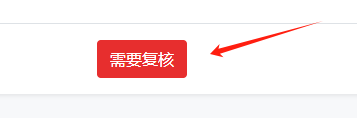
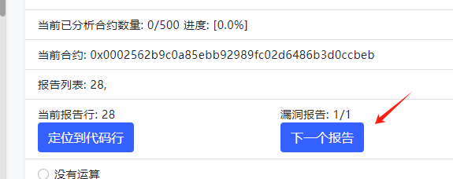
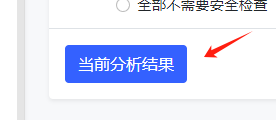
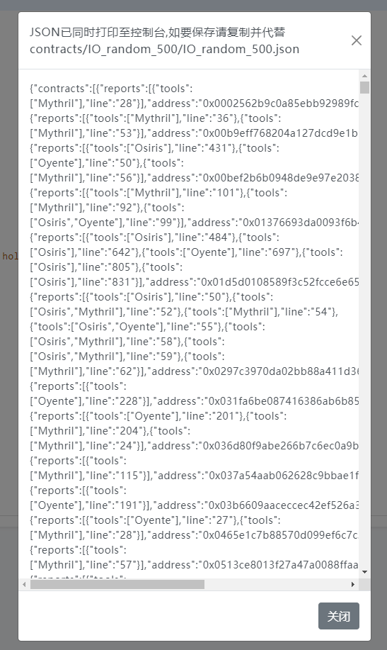
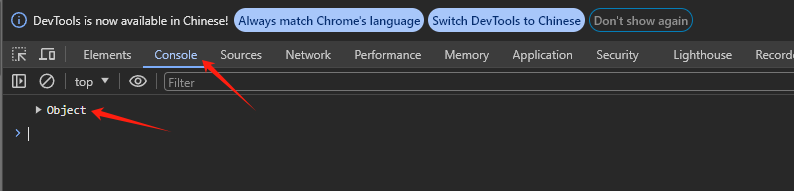
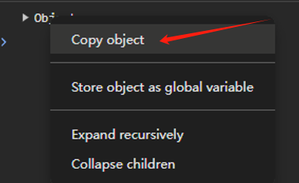

# 整数漏洞假阳性分析

>分析结果将作为：
> 
> 1）实验数据集   
> 2）分析假阳性原因的依据

### 项目运行

项目用js写的，只有前端代码，由于涉及到跨域文件访问，所以不能用浏览器直接打开。

##### 方案一

下载WebStorm（用学生账号激活免费使用1年），用WebStorm打开本项目，点开arithmetic_fp_analyse.html，点击右上角用浏览器打开

##### 方案二

用VSCode + 插件（具体什么插件需要网上搜，我还没用过）

### 假阳性分析

##### 1.点击开始分析

###### 2.点击定位到代码行，分析源码，然后给出分析结果

##### 3.如果报告的分析结果不确定，点击需要复核，保存该合约地址（尽量分析，不要有太多需要复核）

##### 4.分析完当前报告，点击下一个报告，继续分析

### 5.分析记录的保存 **（重要）**
### ！！！！ 建议经常备份分析结果JSON 不要刷新浏览器，防止前功尽弃！！！！
### ！！！！ 建议经常备份分析结果JSON 不要刷新浏览器，防止前功尽弃！！！！
### ！！！！ 建议经常备份分析结果JSON 不要刷新浏览器，防止前功尽弃！！！！

点击当前分析结果，

会有json打印到前端，复制并代替项目中的指定json （从这里复制比较麻烦，推荐从控制台复制）

或者从控制台复制（推荐）：按F12，查看浏览器控制台，会发现有一个Object被打印

右键Object并复制

打开指定的json，把复制内容粘贴进去。下次分析点击开始按钮，将继续分析。

### ！！！！ 建议经常备份分析结果JSON 不要刷新浏览器，防止前功尽弃！！！！
### ！！！！ 建议经常备份分析结果JSON 不要刷新浏览器，防止前功尽弃！！！！
### ！！！！ 建议经常备份分析结果JSON 不要刷新浏览器，防止前功尽弃！！！！
### ！！！！ 建议经常备份分析结果JSON 不要刷新浏览器，防止前功尽弃！！！！
